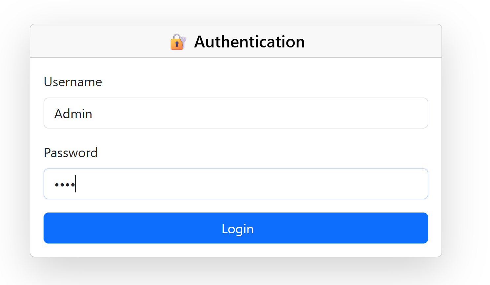
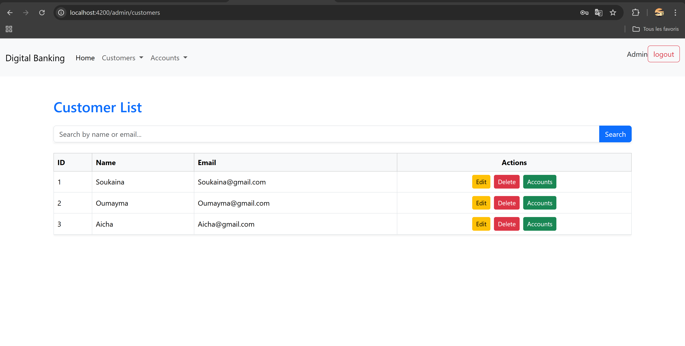
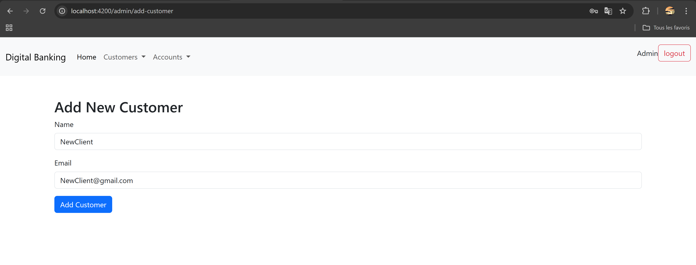
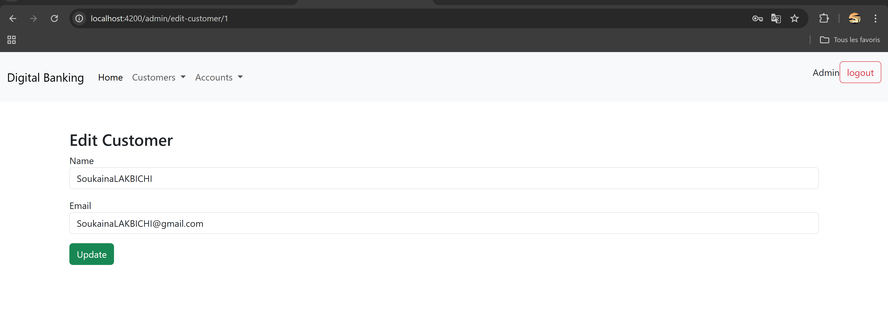
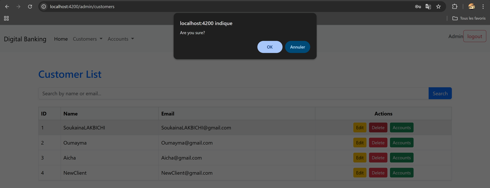
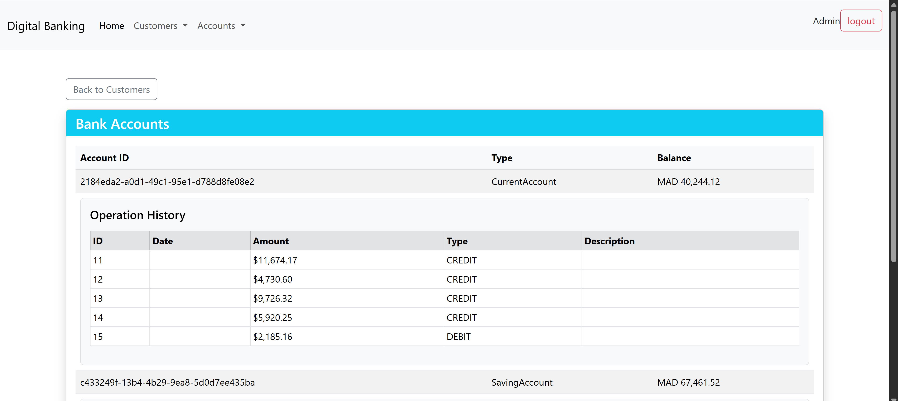
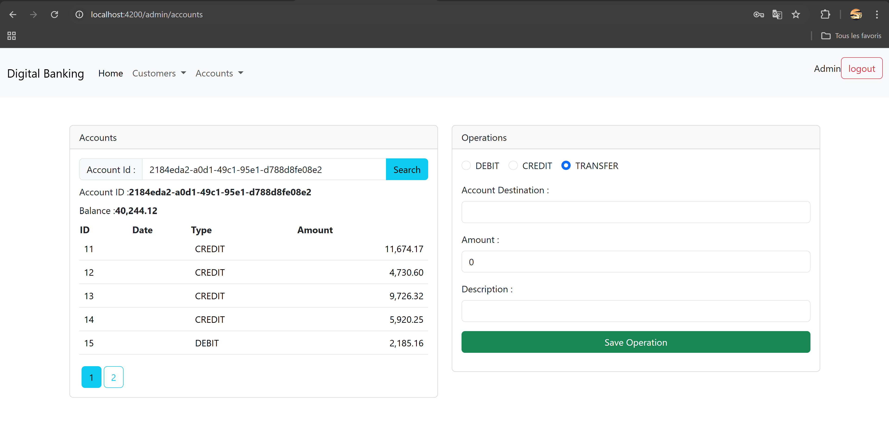
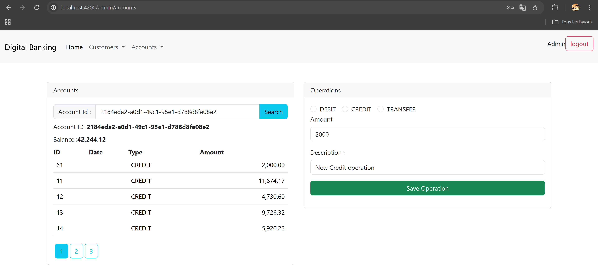
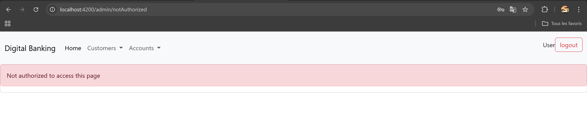

# Digital Banking Application

## 🌐 Aperçu

Digital Banking est une application web complète permettant la gestion des clients et de leurs comptes bancaires. L’application offre une interface sécurisée permettant aux utilisateurs et aux administrateurs d’effectuer diverses opérations bancaires telles que la consultation de comptes, les virements, les crédits, les débits et la gestion des utilisateurs.

---
## 🛠 Architecture Backend
Backend de l'application de banque numérique développé avec **Spring Boot**. Ce service gère les clients, comptes bancaires, opérations (débit, crédit, transfert) et expose une API REST sécurisée.

```
Digital_Banking-Backend/ 
├── src/
│   ├── main/
│   │   ├── java/org/app/digital_banking_backend/ 
│   │   │   ├── DigitalBankingBackendApplication.java      
│   │   │   ├── DTOs/                             #Objets de transfert pour les API (CustomerDTO, AccountDTO, etc.)             
│   │   │   │   ├── AccountHistoryDTO.java
│   │   │   │   ├── AccountOperationDTO.java
│   │   │   │   ├── BankAccountDTO.java
│   │   │   │   ├── CreditDTO.java
│   │   │   │   ├── CurrentAccountDTO.java 
│   │   │   │   ├── CustomerDTO.java
│   │   │   │   ├── DebitDTO.java
│   │   │   │   ├── SavingAccountDTO.java 
│   │   │   │   └── TransferRequestDTO.java
│   │   │   ├── entities/                          # Entités JPA représentant les tables (Customer, BankAccount, etc.)        
│   │   │   │   ├── AccountOperation.java
│   │   │   │   ├── BankAccount.java
│   │   │   │   ├── CurrentAccount.java
│   │   │   │   ├── Customer.java
│   │   │   │   └── SavingAccount.java
│   │   │   ├── enums/                              #Enums pour les statuts et types d'opérations         
│   │   │   │   ├── AccountStatus.java
│   │   │   │   └── OperationType.java
│   │   │   ├── exceptions/                         # Exceptions personnalisées pour la gestion d'erreurs métiers        
│   │   │   │   ├── BalanceNotSufficientException.java
│   │   │   │   ├── BankAccountNotFoundException.java
│   │   │   │   └── CustomerNotFoundException.java
│   │   │   ├── mappers/                             # Convertisseurs entre DTOs et entités       
│   │   │   │   └── BankAccountMapperImpl.java
│   │   │   ├── repositories/                        # Interfaces JPA pour accéder aux données      
│   │   │   │   ├── AccountOperationRepository.java
│   │   │   │   ├── BankAccountRepository.java
│   │   │   │   └── CustomerRepository.java
│   │   │   ├── security/                            # Configuration de la sécurité (JWT, CORS, etc.)
│   │   │   │   ├── SecurityConfig.java
│   │   │   │   └── SecurityController.java
│   │   │   ├── services/                            # Logique métier (interfaces + implémentations)   
│   │   │   │   ├── BankAccountService.java
│   │   │   │   └── BankAccountServiceImpl.java
│   │   │   └── web/                                 # Contrôleurs REST exposant l’API    
│   │   │       ├── BankAccountRestController.java 
│   │   │       └── CustomerRestController.java
│   │   └── resources/
│   │       ├── application.properties               # Configuration (BD, port, JWT secret...)
│   │       ├── static/                              
│   │       └── templates/                           
│   └── test/
│       └── java/org/app/digital_banking_backend/ 
│           └── DigitalBankingBackendApplication.java # Point d’entrée de l’application
├── pom.xml                                          
├── mvnw                                             
├── mvnw.cmd                                         
└── HELP.md
```

## 🧩 Architecture Frontend
Frontend de l'application de banque numérique développé avec Angular. Cette interface permet la gestion des clients, comptes bancaires et opérations, avec un système d'authentification sécurisé.

```
Digital_Banking_Frontend/
├── src/
│   └── app/
│       ├── accounts/                        # Composant affichant la liste des comptes
│       │   ├── accounts.component.ts
│       │   ├── accounts.component.html
│       │   ├── accounts.component.css
│       │   └── accounts.component.spec.ts
│       ├── admin-template/                  # Gabarit pour la mise en page admin
│       │   ├── admin-template.component.ts
│       │   ├── admin-template.component.html
│       │   └── admin-template.component.css
│       ├── customer-accounts/               # Composant des comptes d’un client
│       │   ├── customer-accounts.component.ts
│       │   ├── customer-accounts.component.html
│       │   ├── customer-accounts.component.css
│       │   └── customer-accounts.component.spec.ts
│       ├── customers/                       # Liste des clients
│       │   ├── customers.component.ts
│       │   ├── customers.component.html
│       │   ├── customers.component.css
│       │   └── customers.component.spec.ts
│       ├── edit-customer/                   # Édition d’un client
│       │   ├── edit-customer.component.ts
│       │   ├── edit-customer.component.html
│       │   ├── edit-customer.component.css
│       │   └── edit-customer.component.spec.ts
│       ├── new-customer/                    # Création d’un nouveau client
│       │   ├── new-customer.component.ts
│       │   ├── new-customer.component.html
│       │   ├── new-customer.component.css
│       │   └── new-customer.component.spec.ts
│       ├── login/                           # Formulaire de connexion
│       │   ├── login.component.ts
│       │   ├── login.component.html
│       │   ├── login.component.css
│       │   └── login.component.spec.ts
│       ├── not-authorized/                  # Page d'accès refusé
│       │   ├── not-authorized.component.ts
│       │   ├── not-authorized.component.html
│       │   ├── not-authorized.component.css
│       │   └── not-authorized.component.spec.ts
│       ├── navbar/                          # Barre de navigation principale
│       │   ├── navbar.component.ts
│       │   ├── navbar.component.html
│       │   ├── navbar.component.css
│       │   └── navbar.component.spec.ts
│       ├── services/                        # Services pour accès aux APIs
│       │   ├── account.service.ts
│       │   ├── auth.service.ts
│       │   ├── customer.service.ts
│       │   ├── account.service.spec.ts
│       │   ├── auth.service.spec.ts
│       │   └── customer.service.spec.ts
│       ├── guards/                          # Gardiens d'accès pour les routes
│       │   ├── authentication.guard.ts
│       │   ├── authorization.guard.ts
│       │   ├── authentication.guard.spec.ts
│       │   └── authorization.guard.spec.ts
│       ├── interceptors/                    # Intercepteurs HTTP (ajout JWT)
│       │   ├── app-http.interceptor.ts
│       │   └── app-http.interceptor.service.ts
│       ├── models/                          # Modèles TypeScript
│       │   ├── account.model.ts
│       │   └── customer.model.ts
│       ├── app.component.ts                 # Composant racine
│       ├── app.component.html
│       ├── app.component.css
│       ├── app.component.spec.ts
│       ├── app.config.ts                    # Configuration de l'application
│       └── app.routes.ts                    # Définition des routes Angular
```

## ⚙️ Fonctionnalités

### 🔙 Backend 

* **Gestion des clients**

  * Création, modification, recherche et suppression de clients.

* **Gestion des comptes bancaires**

  * Consultation des détails d’un compte.
  * Affichage de l’historique des opérations.
  * Réalisation d’opérations : débit, crédit et virement entre comptes.

* **Sécurité**

  * Authentification basée sur JWT (JSON Web Token).
  * Contrôle d’accès basé sur les rôles (`USER`, `ADMIN`).
  * Configuration CORS pour permettre la communication avec le frontend.

* **Principaux points d’accès de l’API**

  * `POST /auth/login` : Authentifie un utilisateur et renvoie un token JWT.
  * `GET /customers` : Liste tous les clients.
  * `GET /customers/search?keyword={kw}` : Recherche de clients par mot-clé.
  * `POST /customers` : Crée un nouveau client.
  * `DELETE /customers/{id}` : Supprime un client.
  * `GET /accounts/{accountId}/history?page={p}&size={s}` : Récupère l’historique d’un compte avec pagination.
  * `POST /accounts/debit` : Effectue un débit sur un compte.
  * `POST /accounts/credit` : Effectue un crédit sur un compte.
  * `POST /accounts/transfer` : Réalise un virement entre deux comptes.

---

### 🖥️ Frontend 

* **Gestion des clients**

  * Affichage de la liste des clients avec identifiant, nom et email.
  * Recherche de clients par mot-clé.
  * Ajout de nouveaux clients avec validation du formulaire (nom, email).
  * Suppression de clients avec confirmation.
  * Modifier les informations d'un client 
  * afficher la liste des compte d'un client

* **Gestion des comptes**

  * Recherche de comptes par identifiant pour consulter le solde et l’historique des opérations.
  * Réalisation d’opérations bancaires :

    * **Débit** : saisie du montant et description.
    * **Crédit** : saisie du montant et description.
    * **Virement** : saisie du montant, description et identifiant du compte bénéficiaire.
  * Affichage paginé de l’historique des transactions.

* **Authentification et autorisation**

  * Page de connexion pour authentifier les utilisateurs et récupérer le token JWT.
  * Fonctionnalité de déconnexion qui supprime le token et redirige vers la page de login.
  * Page "Accès non autorisé" pour les tentatives d'accès à des routes restreintes.
  * Intercepteur HTTP pour ajouter automatiquement le token JWT aux requêtes API.
  * Garde de routes (`AuthentificationGuard`, `AuthorisationGuard`) pour sécuriser l’accès aux pages protégées.

---


## 🧪 Démonstration

### 1. Page de Connexion

Chaque utilisateur (Admin ou User) se connecte via une page de login.



---

### 2. Gestion des Clients

#### 🔍 Liste des clients (ADMIN et USER)
Les utilisateurs peuvent voir la liste des clients avec leur ID, nom et email.



#### ➕ Ajouter un client (ADMIN uniquement)
Un formulaire permet d'ajouter un nouveau client avec validation.



#### 📝 Modifier un client (ADMIN uniquement)



#### ❌ Supprimer un client (ADMIN uniquement)
Suppression avec une confirmation.



---

### 3. Gestion des Comptes

#### 📂 Liste des comptes liés à un client (ADMIN uniquement)

L'administrateur peut voir tous les comptes associés à un client donné.



#### 🔄 Historique des opérations (ADMIN et USER)

Recherche d’un compte par ID pour afficher le solde et l’historique paginé des opérations (crédit, débit, transfert).



#### 💸 Opérations (ADMIN uniquement)

- **Créditer un compte**
- **Débiter un compte**
- **Effectuer un virement vers un autre compte**



#### 🚫 Accès refusé (USER)

Lorsqu’un utilisateur essaie d’accéder à une fonctionnalité réservée à l’ADMIN (comme l’ajout de client ou les opérations sur les comptes), il est automatiquement redirigé vers une page d’erreur :




## ✅ Installation / Prérequis

### 🚀 Installation

**Backend**
```
git clone https://github.com/SoukainaLAKBICHI2/Digital_Banking-Backend.git
cd Digital_Banking-Backend
./mvnw spring-boot:run
```

Assurez-vous d’avoir :
> * Java 17+
> * Maven
> * MySQL ou PostgreSQL (selon config)

**Frontend**
```
git clone https://github.com/tonrepo/Digital_Banking_Frontend.git
cd Digital_Banking_Frontend
npm install
ng serve
```

Assurez-vous d’avoir :
>
> * Node.js
> * Angular CLI


### ✅ Configuration
Fournis un exemple de fichier `application.properties` (ou `.env` s’il y en a un).

```
# application.properties
spring.application.name=Digital_Banking_Backend
server.port=8084
spring.datasource.url=jdbc:mysql://localhost:3306/Digital_Banking?createDatabaseIfNotExist=true
spring.datasource.username=root
spring.datasource.password=
spring.jpa.hibernate.ddl-auto=create
spring.jpa.properties.hibernate.dialect=org.hibernate.dialect.MariaDBDialect
spring.jpa.show-sql=true
jwt.secret=your_jwt_secret
```
## 👩‍💻 Author

Build with passion and ❤️ by 👩‍💻 Soukaina LAKBICHI
